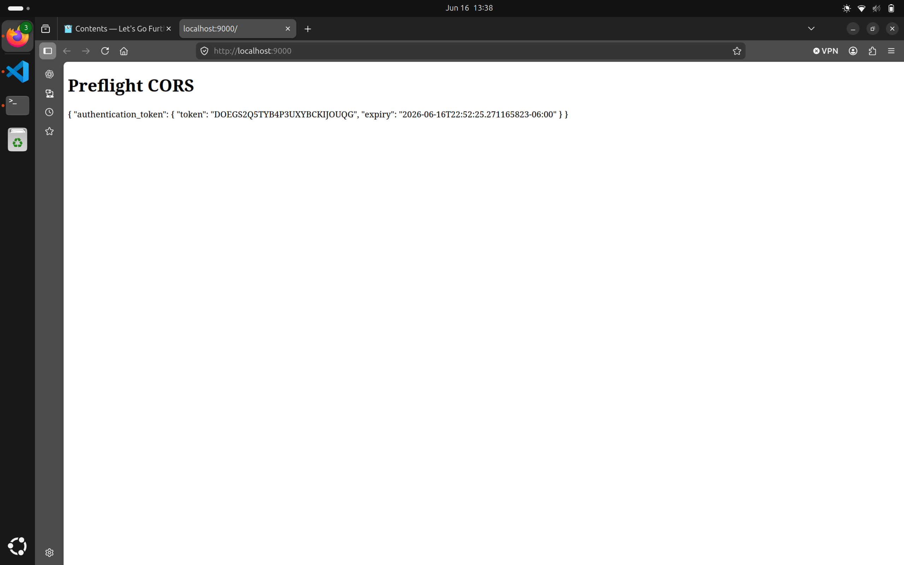
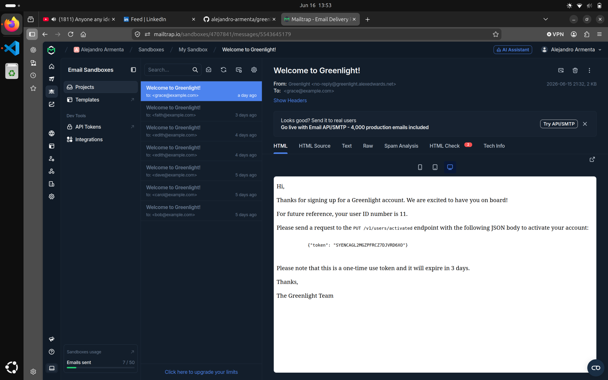

# Greenlight Website

This is a Website I made in GO, it has the next features:

-   Preflight CORS and simple CORS.
-   Permission Based Authorization (READ - WRITE ACCESS control).
-   User Authentication.
-   User Activation.
-   Sending emails.
-   User Registration.
-   Graceful shut down of the server tu respond to last infly requests.
-   Rate Limiting to prevent excessive strain on the server.

## CORS

This is a request made with Preflight CORS by another server into my API, From a different origin. 

The web browser first sends a preflight CORS request and I sent valid request methods and valid request headers for real request.

Then the real request is made for user authentication.

## USER ACTIVATION

For user activation, when a user registers I send an email to activate account like this one:

The user sends a put request to the endpoint to activate his account with the token given as a JSON request.

