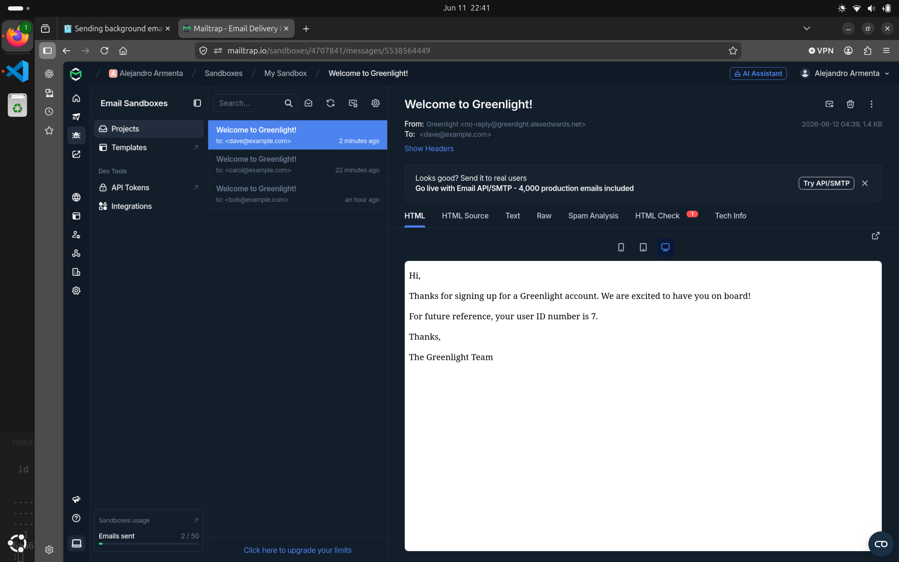

# Greenlight REST API

This is a Website I made in GO, it has the next features:

-   REST API Backend.
-   User Registration.
-   Sending Email to user for account activation.
-   Rate Limiting to prevent excessive strain on the server
-   Graceful shut down of the server tu respond to last infly requests.
-   CRUD operations on movies.
-   Full text search on movie titles.
-   Filtering, sorting and pagination of results.
-   Database Migrations for PostgreSQL

This is an Email sent to user:

